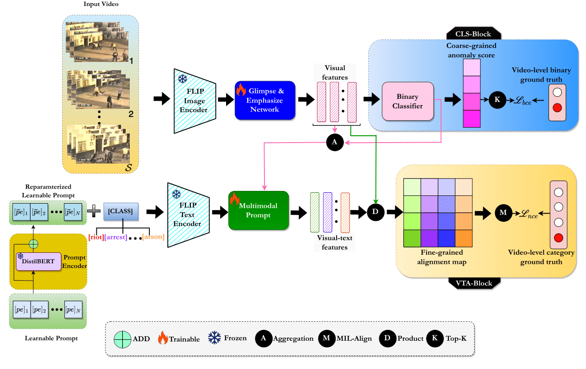

# ReFLIP-VAD
This is the official Pytorch implementation of our paper:
**"ReFLIP-VAD: Towards Weakly Supervised Video Anomaly Detection via Vision-Language Model"** in TCSVT 2024.
Paper can be downloaded from  **<a href="https://ieeexplore.ieee.org/abstract/document/10723764" target="_blank">here</a>.**  
> <a href="https://scholar.google.com/citations?user=XVAWNbEAAAAJ&hl=en" target="_blank">Prabhu Prasad Dev</a>, <a href="https://scholar.google.co.in/citations?user=rcogsCMAAAAJ&hl=en" target="_blank">Raju Hazari</a>, <a href="https://scholar.google.co.in/citations?user=suWm38AAAAAJ&hl=en" target="_blank">Pranesh Das</a>

## Framework


## Highlights
- A novel framework i.e. ReFLIP-VAD is developed that employs a prompt encoder to generate reparameterized learnable prompt templates instead of hand-crafted templates. These templates are contextually rich, enhancing interpretability and providing a deeper understanding of the specific semantics associated with anomalies. 

- The proposed approach comprises a classification block and a video-text alignment block. The former leverages visual features for binary classification while the latter leverages both textual and visual features for language-vision alignment. Consequently, this dual block based proposed approach is able to detect video anomalies at both coarse and fine-grained levels.

- A Glimpse-Emphasize network is developed that effectively captures both the global and local temporal dependencies across time. The MIL-Align mechanism is also developed to optimize visual-language alignment under weak supervision. 

- The effectiveness of ReFLIP-VAD is demonstrated on two large-scale benchmarks. ReFLIP-VAD achieves state-of-the-art performance, including 86.29\% AP on XD-Violence and 89.14\% AUC on UCF-Crime, surpassing existing state-of-the-art methods by a large margin.

The following files need to be adapted in order to run the code on your own machine:
- Change the file paths to the download datasets above in `list/xd_ReFLIP_rgb.csv` and `list/xd_ReFLIP_rgbtest.csv`. 
- Feel free to change the hyperparameters in `xd_option.py` and `ucf_option.py`

## <a name="2"></a> Prerequisites
- <a href="https://releases.ubuntu.com/22.04/" target="_blank" rel="noreferrer">  </a> Operating system
    - Ubuntu 22.04.4 LTS 
- <a href="https://developer.nvidia.com/cuda-toolkit" target="_blank" rel="noreferrer">  </a> Graphics card
    - GPU: NVIDIA RTX 4070
- <a href="https://pytorch.org/get-started/previous-versions/" target="_blank" rel="noreferrer">  </a> Framework and environment
    - pytorch: 1.13 or higher
    - cuda: 12.1
    - torchvision: 0.14
- <a href="https://docs.conda.io/en/latest/miniconda.html" target="_blank" rel="noreferrer">  </a> Programming language
    - python: 3.10 or higher

### Dataset
#### UCF-Crime
-The dataset can also be downloaded from the following link: <a href="https://visionlab.uncc.edu/download/summary/60-data/477-ucf-anomaly-detection-dataset" target="_blank"> Download </a>

-You can also download the dataset in parts through the following link: <a href="https://www.dropbox.com/sh/75v5ehq4cdg5g5g/AABvnJSwZI7zXb8_myBA0CLHa?dl=0" target="_blank">Download </a>

#### XD-Violence
-The dataset can also be downloaded from the following link: <a href="https://roc-ng.github.io/XD-Violence/" target="_blank"> Download </a>

### Train and Test
After the setup, run the following command: 
Training and infer for UCF-Crime dataset
```
python ucf_train.py
python ucf_test.py
```

Training and infer for XD-Violence dataset
```
python xd_train.py
python xd_test.py
```


## <a name="6"></a> Results 

|    dataset   | features | gpus | AUC (%) |                                             
|:------------:|:--------:|:----:|:-------:|
| UCF-Crime |    CLIP  |   1  |  88.57   | 
| UCF-Crime |    FLIP  |   1  | 89.14  | 
|   XD-Violence  |    CLIP   |   1  |  85.81 | 
|   XD-Violence  |    FLIP   |   1  |  86.29 | 

